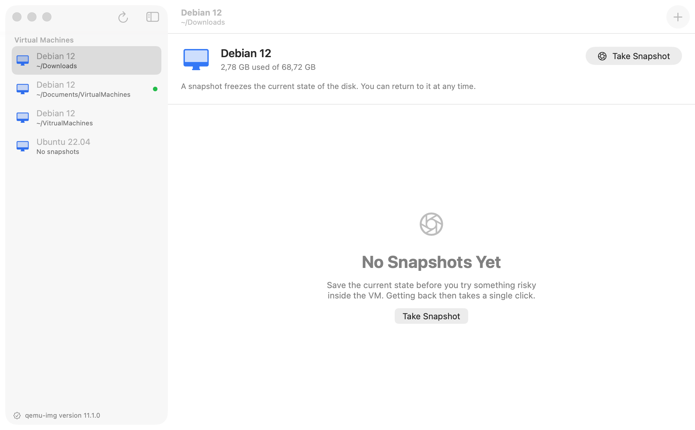

# UTM Snapshot Manager

Restore points for [UTM](https://mac.getutm.app) virtual machines — as a proper Mac app.

UTM has no snapshot interface of its own; the feature request was
[closed as *not planned*](https://github.com/utmapp/UTM/issues/6020). The QEMU backend
underneath it *does* support snapshots on `qcow2` disks, it just has no face. This app is
that face: it finds your machines by itself, lets you mark one state as the baseline you
keep coming back to, and refuses to touch a disk it cannot prove is idle.



## Install

**Download the disk image** from [Releases](https://github.com/nurkert/UTM-Snapshot-Manager/releases),
drag the app to Applications, then right-click it once and choose **Open**. The build is
signed ad-hoc rather than with a paid Apple Developer ID, so the first launch needs that
confirmation — after that, double-clicking works.

**Or build from source:**

```sh
git clone https://github.com/nurkert/UTM-Snapshot-Manager.git
cd UTM-Snapshot-Manager
./install.sh
```

The script installs what's missing (QEMU via Homebrew, XcodeGen), builds the app and puts it
into `/Applications`. Requires macOS 14 or newer and Xcode.

On first launch macOS asks for two permissions. Both matter:

- **Documents / Downloads / Desktop** — so your machines can be found.
- **Control UTM** — so the app can ask whether a machine is running. Without this it cannot
  tell running from paused, and it will refuse to write to any disk rather than guess.

## The idea

Snapshotting is a loop, not a one-off. You save a known-good state, do something to the
machine, and come back. That loop is what the app is built around:

**Pick a baseline.** Mark the state you want to return to — a clean install, a prepared lab,
a machine before the sample ran. It floats to the top of the list and gets its own action.

**Reset to it in one step.** *Reset to Baseline* shuts the machine down, rolls every disk
back, and starts it again. One confirmation, one operation, instead of three trips to UTM
and back. The dialog lists each step before it happens.

**Never on a live disk.** Every destructive action is gated on one question: is this machine
shut down? UTM is asked directly — it is the only thing that can tell *running* from
*paused*, and both are equally unsafe. The answer is polled every few seconds, so a machine
you start in UTM disables the buttons here within seconds. It is asked again immediately
before the write itself, and an inconclusive answer blocks the write just like a definite
"it's running" does.

## What it does

**Finds your machines by itself.** No adding, no groups, no configuration. Spotlight plus a
narrow scan of the folders UTM actually uses — including UTM's own container, which is where
a stock install keeps everything. Each root gets its own deadline, so one stalled folder
can't take the scan down with it. Machines with the same name are told apart by their folder.

**Knows which bundle is which.** Duplicating a `.utm` bundle copies its identifier too, so a
backup in Downloads looks exactly like the machine UTM is running. Identity is therefore
decided on the path UTM recorded, never on the identifier — and when that record cannot be
read, no bundle claims to be the managed one. Start and stop can never land on the wrong
machine, and the failure mode is a greyed-out button rather than someone else's VM shutting
down.

**Reads the machine's configuration, not the folder.** Disks come from `config.plist`, which
states which drives are real disks and which are CD-ROMs or read-only. Scanning for `*.qcow2`
instead would happily treat a mounted installer image as a system disk.

**Handles multi-disk machines as one unit.** A restore point spans every disk. If creating it
fails on the third disk, the first two are rolled back so a half-made restore point never
survives to be applied later. Restoring verifies completeness *before* touching anything, and
on a multi-disk machine the safety snapshot is mandatory, because a rollback that fails
partway cannot be undone.

**Says what happened.** After a rollback the app states which point the machine is at. A
partial write — the one case where a machine can be left inconsistent — is reported naming
exactly which disks changed and what to do next.

## Beyond snapshots

Everything here is either read-only or goes through the same shut-down gate:

| Action | What it does |
| --- | --- |
| **Start / Shut Down / Suspend** | Drives UTM directly. Shut Down asks the guest, so it can flush its file system. |
| **Verify Disks** | `qemu-img check` reads every block and reports corruption. Read-only, safe on any machine. |
| **Export Restore Point** | Writes one restore point out as a standalone `qcow2`. Reads the source only — a clean way to hand a state to someone else. |
| **Show in Finder / Open in UTM** | The obvious ones. |

## Keyboard

The loop is meant to be driven from the keyboard.

| Shortcut | Action |
| --- | --- |
| `⌘N` | Take snapshot |
| `⌘↩` | Restore selected point |
| `⇧⌘↩` | Reset to baseline |
| `⌘B` | Set / remove baseline |
| `⌘⌫` | Delete restore point |
| `⇧⌘E` | Export restore point |
| `⇧⌘S` | Start machine |
| `⇧⌘P` | Shut down machine |
| `⇧⌘U` | Suspend machine |
| `⇧⌘K` | Verify disks |
| `⌘U` | Open UTM |
| `⇧⌘I` | Show in Finder |
| `⌘R` | Rescan for machines |

Destructive confirmations deliberately do *not* take `↩` — Cancel does. Restoring throws away
work, and a dialog that does that on a stray Return press is a trap.

## How it works

Snapshot operations go through `qemu-img`, the tool that ships with QEMU:

| Action | Command |
| --- | --- |
| Read | `qemu-img info -U --output=json <disk>` |
| Create | `qemu-img snapshot -c <name> <disk>` |
| Restore | `qemu-img snapshot -a <name> <disk>` |
| Delete | `qemu-img snapshot -d <name> <disk>` |
| Verify | `qemu-img check -U --output=json <disk>` |
| Export | `qemu-img convert -U -l snapshot.name=<name> -O qcow2 <disk> <out>` |

Reading uses `-U`, which skips the image lock. That is safe because those commands only read,
and without it the snapshot list would be unavailable exactly when a machine is running. The
write commands deliberately do *not* use `-U`: if another process holds the lock, the write
must fail.

Machine state comes from UTM over AppleScript, with the process table as a backstop for
bundles UTM doesn't manage — matched on the image path, so it stays right even when two
bundles share a UUID.

Every external command runs with a deadline and is terminated if it overruns. Snapshots live
*inside* the `qcow2` file, cost almost nothing when created, and grow as the disk diverges.
UTM's own `suspend` snapshot is hidden from the list and its name reserved.

## Requirements

- macOS 14 or newer
- [UTM](https://mac.getutm.app) with QEMU-backend machines. Apple Virtualization uses a disk
  format that has no snapshots — those machines are listed but marked unsupported. UTM is
  optional for snapshots themselves, required for starting and stopping machines from here.
- `qemu-img` (`brew install qemu`) — the app walks you through this if it's missing.
  UTM does bundle its own copy, but as a dynamic library that only UTM can load.

## Building manually

```sh
brew install xcodegen qemu
Scripts/build-app.sh      # icon, project, universal build, ad-hoc signature
Scripts/make-dmg.sh       # packages dist/UTM-Snapshot-Manager-<version>.dmg
```

The Xcode project is generated from `project.yml`, so it never shows up as noise in diffs.
`Tools/MakeIcon.swift` draws the icon from an SF Symbol, so it stays reproducible.

## Caveats

- **Shut the machine down first.** Not paused, not suspended — off. The app enforces this,
  but it cannot do it for a machine UTM doesn't manage.
- Denying the Automation permission leaves the app unable to confirm a machine is idle. It
  then blocks all writes rather than guessing. This is deliberate.
- macOS also asks to let the app "access data from other apps". That is UTM's registry, and
  it is the only thing that says which bundle on disk UTM actually manages — UTM's scripting
  interface reports identifiers, and a duplicated `.utm` carries the original's identifier.
  Denying it costs the Start and Shut Down buttons, and nothing else: snapshots keep working,
  and no machine is ever claimed to be one UTM manages on a guess.
- The app is ad-hoc signed, so its signature changes with every build. macOS ties permissions
  to that signature, which means it asks for access again after each rebuild.
- Spotlight does not index `.utm` bundles on every Mac. When it comes back empty the folder
  scan is the only source, which is why a timed-out scan keeps the previous list instead of
  clearing it, and says so.
- Snapshots are not backups. They live inside the same disk image; if that file is lost, so
  are they. *Export Restore Point* is the way to get a state out of the image.
- Live snapshots including memory state are out of scope. That needs QEMU's monitor, not
  `qemu-img`. Suspending through UTM is the closest equivalent.
- The UI is English only. Every string goes through `String(localized:)` or
  `LocalizedStringKey`, so adding a String Catalog is a small, self-contained change.

## Relationship to the original

This is a fork of [Metamogul/UTM-Snapshot-Manager](https://github.com/Metamogul/UTM-Snapshot-Manager),
rewritten from scratch. The original was explicitly a proof of concept.

| Original | Here |
| --- | --- |
| VMs added manually and sorted into groups | Found automatically, no setup |
| Warned about running VMs in the README | Asks UTM, polls it, and blocks the action |
| Snapshot list parsed from `qemu-img` text with regexes | Parsed from `--output=json` |
| Disks found by scanning for `*.qcow2` | Read from the machine's `config.plist` |
| Rows often needed two or three clicks to select | Whole row is one hit target |
| Restore was irreversible | Safety snapshot, mandatory on multi-disk machines |
| No machine control | Start, shut down and suspend through UTM |
| No app icon of its own | Own icon, generated from an SF Symbol |

## License

Apache 2.0, same as the original project.
